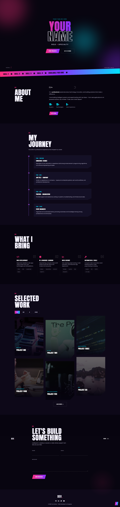

# 🚀 Personal Portfolio Website

A modern and fully responsive portfolio website built with HTML, CSS, and JavaScript to showcase my skills, projects, education, and experience as an AI Engineer and Web Developer.

Designed with a futuristic UI, smooth animations, interactive components, and a clean user experience.

---


## ✨ Features

### 👨‍💻 About Me

- Professional introduction
- Education & career timeline
- Animated statistics
- Personal profile section

### 💼 Projects

- Dynamic project gallery
- Project filtering
- Interactive project modal
- GitHub project links
- Responsive project cards

### 🛠 Skills

- Web Development
- Artificial Intelligence
- Machine Learning
- Deep Learning
- Data Science
- Computer Vision
- Natural Language Processing
- Automation & Development Tools

### 🎨 User Experience

- Modern futuristic UI
- Fully responsive layout
- Smooth scrolling
- Scroll reveal animations
- Animated counters
- Custom preloader
- Interactive navigation menu
- Cursor glow effect
- Back-to-top button

### 📩 Contact

- Contact form
- Form validation
- Email integration (Formspree)
- Social media links

---

## 🛠 Built With

- HTML5
- CSS3
- JavaScript (ES6)
- Font Awesome
- Google Fonts

---

## 📱 Responsive Design

Optimized for:

- Desktop
- Laptop
- Tablet
- Mobile

---

## 📂 Project Structure

```
portfolio/
│
├── index.html
├── css/
│   └── style.css
├── js/
│   └── script.js
├── assets/
│   ├── images/
│   └── icons/
└── README.md
```

---

## 🚀 Future Improvements

- Dark / Light mode
- Blog section
- Project search
- Multi-language support
- Download CV
- More animations
- Backend contact system
- Admin dashboard

---

## 📸 Preview

This portfolio includes:

- Hero section
- About Me
- Experience Timeline
- Skills
- Projects Showcase
- Contact Form
- Responsive Navigation
- Animated UI Components

---

## 👨‍💻 Author

**Khalil Nouar**

AI Engineer • Machine Learning Enthusiast • Web Developer

---

## 📄 License

This project is licensed under the MIT License.

---

⭐ If you like this project, consider giving it a star.
